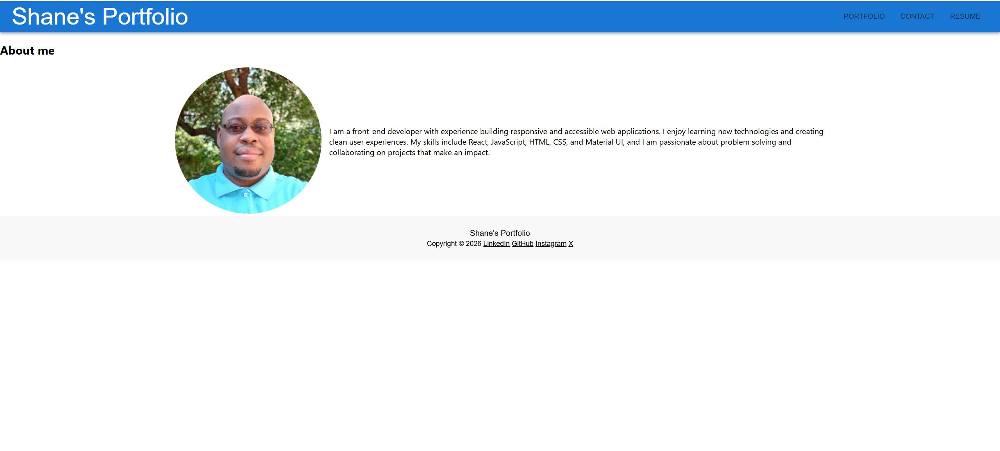

# React Portfolio

A modern React portfolio website built with Create React App, Material UI, and a clean, responsive layout. This project showcases my about section, portfolio projects, resume, and contact information in a polished single-page experience.

## Highlights

- Responsive design for desktop and mobile
- Professional portfolio sections for About, Projects, Resume, and Contact
- Clean styling with Material UI components
- Easy to customize with my personal information and project details

## Website Preview

## Deployed Website

Visit the live portfolio here: **[React Portfolio](https://kranniax.github.io/react-portfolio/)**

## Tech Stack

- React
- JavaScript
- Material UI
- Create React App

## Getting Started

1. Install dependencies:
   npm install

2. Start the development server:
   npm start

3. Open <http://localhost:3000> to view the app in your browser.

## Available Scripts

- npm start — Runs the app in development mode
- npm test — Launches the test runner
- npm run build — Builds the app for production

## Project Structure

- src/components — Reusable sections such as About, Portfolio, Resume, and Contact
- src/utils — Helper functions and project data
- public — Static assets and the app shell

## Contributions

- Shane Bramble-Wade
